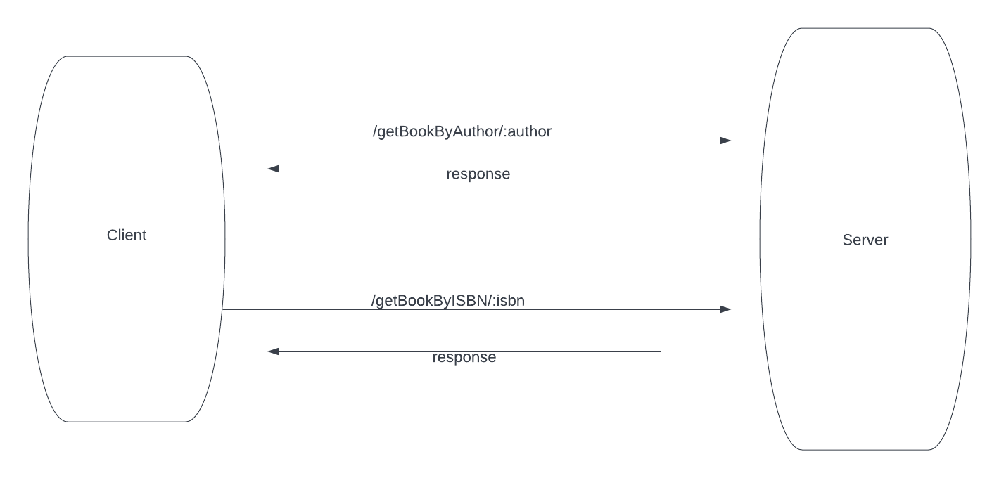

## JavaScript Code Test - Refactoring

So, as part of the code test, I was given a simple class that makes a call to a HTTP API to retrieve a list of books and return them. There were things I needed to think of, such as extensibility, API formats, different query types

## Getting Started
1) Clone this repository
2) on the terminal enter 'npm install' to install the dependancies
3) on the terminal enter 'npm run start:dev' to start the development server 
4) on your browner navigate to this URL http://localhost:5000/api/books/getBookByAuthor/j_k_rowling to see the results for books from JK Rowling

There was one caveat I realised, the API url provided was fake, it did not return any data, so I used OpenLibrary's free API to complete this exercise to the best of my ability towards the scope of the exercise

## Routes

There are only 2 routes in this program
1) /getBookByAuthor/:author
2) /getBookByISBN/:isbn

### Assumptions

So, on the original GitHub page, it was said to think about extensibility, meaning the ability to request data from different URL's and returning it to the user. So I thought it would be best to have a file specifically for holding URL's for different functions, for example, in this case, in the file apiLinks.ts, I have created 2 arrays searchByISBNApis, and searchByAuthorApis which in theory, could contain URL's should we want to request data from them if we were to search by ISBN and Author, as potentially, different API's could be used with the same query paramters.

However, this project was specifically built with OpenLibrary's free API, so as a result, this project works best with that API. Perhaps, if given enough time, I could have made this program more generic so it can potentially handle any API.

## Design Patterns
I used the decorator pattern to define the routes, adds more flexibility, with this method, you can easily rename the routes on a single line, scales pretty well.

One thing I did consider was different potential response types that can be returned when requesting data from API's. Particularly, XML documents, so I used an external module called xml2js to convert any potential XML responses to JSON, should that be the case!

### Tests
Unfortunately, I did not have enough time to write tests, as I was on a time constraint from juggling between various technical tests from different companies. However, if given enough time, I would write these integration tests and unit test

The integration test would be the following

POSITIVE SCENARIOS

1) test to see if /getBookByAuthor/:author route returns data
2) test to see if /getBookByISBN/:isbn route returns data

the unit tests would be the following
1) getBooksByAuthor 
    a) test to see if response is json, then the correct information is returned
    b) test to see if response is xml, then the xml is converted to json (via the xml2js library) and then returned

2) getBookByISBN
    a) test to see if correct ISBN format is entered as query paramters
    b) test to see if response is json, then the correct information is returned
    c) test to see if response is xml, then the xml is converted to json (via the xml2js library) and then returned

I would go through this process, test and refactor until I reach the optimal solution. This would have required a lot of mocking of external dependancies. Doable with Jest.